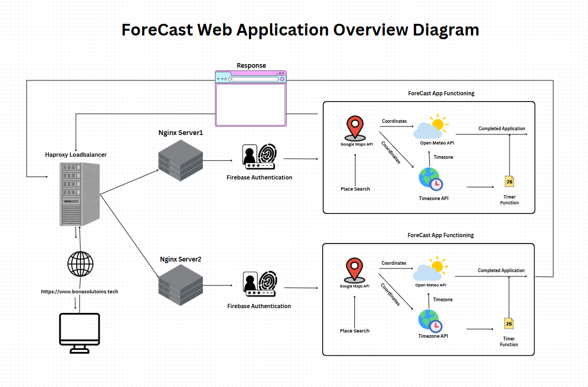
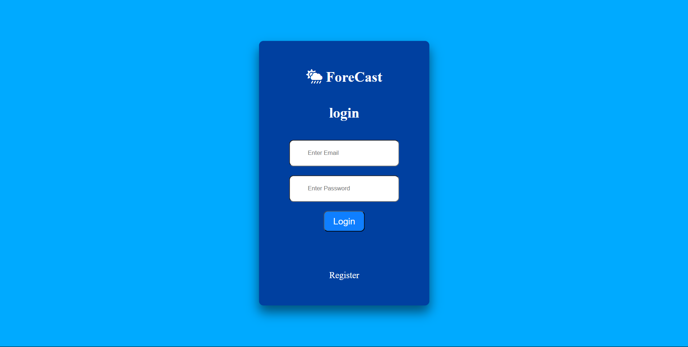
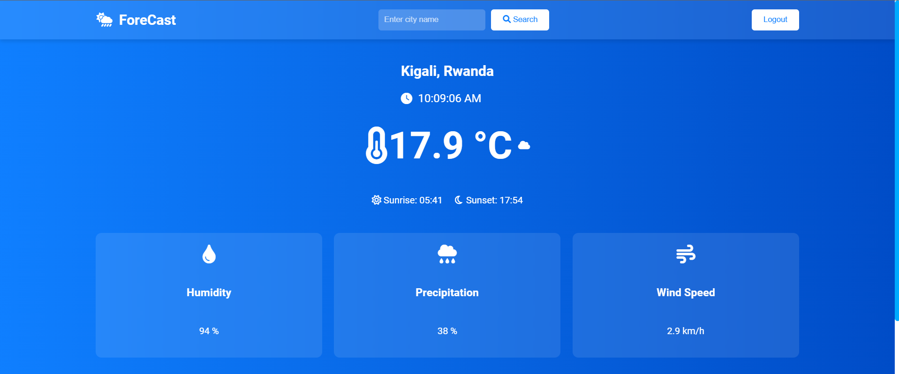
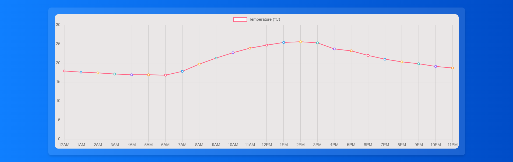
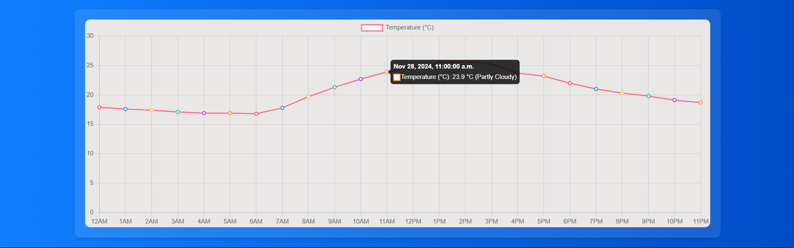

# FORECAST

## Description

Forecast is web based application that fetches daily weather conditions
of a given place.

## Reason (Problem Solving)

I have created forecast to assess the climate changes where sometimes it
rains while it is in a rainy season, so with Forecast everyone would be
able to know the weather conditions of every hour so that he/she can
plan his day perfectly.

## Features

### API integration:

Fetches real-time weather data from external weather APIs

### User Interaction:

Allows users to filter based on location and view hourly forecasts

### FrontEnd:

Simple, intuitive and User Friendly Interface with HTML, CSS and Javascript

### Backend:

Easy written codes with comments for eased readability

### Error Handling:

Gracefully handles APIs downtimes or errors during data fetching

## TECHNOLOGIES USED

### FrontEnd
HTML, CSS, Javascript

### Backend:

Python Flask

### APIs Used:

- Google Maps Geolocation API
- Timezonedb.com API
- OpenMeteo.com API

### Deployment:

- Nginx (web server software):

In the Deployment to NGINX scp command to push codes from
localhost to the machine has been used.
After that a new directory was created at /var/www/ namely Forecast
which was then referenced in the config file at /etc/nginx/sites-available/ForeCast
in the root /var/www/Forecast, to server it's html file.

After that a symbolic link was created at /etc/nginx/sites-enabled/ named Forecast with the help
of the ln -s command

- Haproxy (For Reverse proxying or Loadbalancing):

In the Load balancer configuration we used the two servers web01 and web02 to be proxy passed to,
and also did route hosting so that based on the routes it knows where to pass the requests (because I used a flask app).

## Web Application Diagram

## Demo

### Login Page

### Function Page

### ForeCasting

When the user hovers to one of the grap points he/she gets a forecasted weather condition

### Special Thanks To
- 
- 
- 
